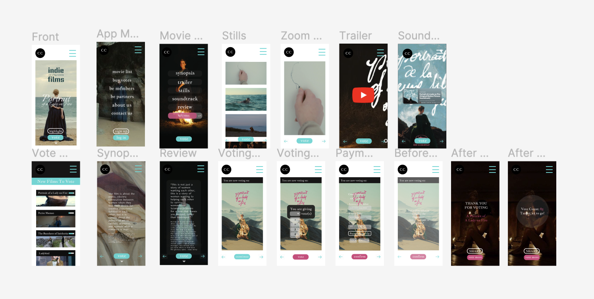

# 🎥 Ongoing Personal Project 🎥

Embarking on this journey post-School of Code, I proudly present my self-initiated endeavor:

## 🎬 Cinematic Choice (CC)🎬 

Step into the world of Cinematic Choice (CC), a groundbreaking platform empowering movie enthusiasts and independent filmmakers. With a core belief in the magic of independent cinema, CC allows users to curate their cinematic experiences by voting for the films they're excited about. Bridging the gap between audiences and talented filmmakers without traditional distribution, CC reshapes the film industry. Unlike general crowdfunding, CC provides a dedicated space for cinema, sidestepping competition and ensuring filmmakers connect directly with their audience. Welcome to Cinematic Choice, where every vote transforms the way movies come to life.

  

## 📌 User Story:
"As a movie enthusiast, I want to support 
and experience independent films on the big screen 
so that I gain inspiration from their unique storytelling approaches."

## 📌 Problems:
In a landscape where traditional distribution is dominant, the accessibility to screenings of undisturbed independent films remains an arduous challenge.

## 📌 Unique Features:
The imminent release of our MVP promises an array of compelling features. Users will be presented with a curated selection of movies, each beckoning for their votes. The process is elegantly streamlined, allowing for the purchase of votes online. Once a film amasses the requisite number of votes, it propels into the next phase—a meticulously arranged screening within a supportive cinema. As a gesture of gratitude, the voters-turned-patrons not only gain exclusive VIP tickets but also receive thoughtfully crafted special gifts, acknowledging their pivotal role in breathing life into these cinematic dreams.

✨Featuring Films:
Each featured film encompasses a brief synopsis, an engaging trailer, evocative stills, an immersive soundtrack, insightful reviews, and a real-time vote count. This holistic approach empowers users to make informed choices and celebrate the essence of independent cinema.

✨Vote Count: 
Elevating the momentum, the live vote count stands as a beacon of significance. It vividly portrays the journey of each film, illuminating how much attention it has received. Equally crucial, it reveals the number of votes required to propel this film to its coveted screening, empowering users with a tangible sense of impact before they cast their decisive votes. 

Join us in this cinematic odyssey! Welcome to Cinematic Choice, where each vote shapes the story of change, frame by frame!

## 🔎 Team Members: 
👩🏻‍🎨 🛼 🧑🏻‍🌾 🏝️
Introducing the dynamic duo of Carrie Shen and Jiu Kam. Hailing from the vibrant tech landscape of Hong Kong, we don't just craft code – we infuse aesthetics into app design and development. By channeling our skills and passion, we're engineering a platform that speaks to the niche but impactful world of independent cinema. Our compass is set on amplifying the voices and stories often overlooked, championing the underrepresented and celebrating diversity. 
